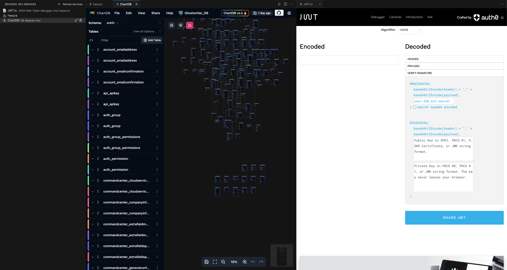

# DevDock

DevDock is a VS Code extension that provides a centralized hub for accessing and managing your development services directly from your editor. It eliminates the hassle of constantly switching between browser tabs and remembering port numbers by bringing all your microservices, databases, documentation, and development tools into one convenient sidebar.



## Features

- **Service Sidebar**: Quick access to all your development services from the VS Code activity bar
- **In-Editor Viewing**: Open services directly in VS Code using the built-in webview
- **External Browser Support**: Option to open services in your external browser
- **Easy Management**: Add, edit, and remove services with a few clicks
- **Custom Icons**: Assign custom icons to your services for easy identification
- **Persistent Configuration**: Your service configuration is saved and persists between VS Code sessions

## Installation

You can install DevDock from the VS Code Marketplace:

1. Open VS Code
2. Go to Extensions (Ctrl+Shift+X)
3. Search for "DevDock"
4. Click Install

Alternatively, you can [download the VSIX file](https://github.com/calumsudo/DevDock/releases) and install it manually.

## Usage

### Adding a Service

1. Click the DevDock icon in the activity bar
2. Click the "+" button in the sidebar header
3. Enter the service name, URL, and optional description
4. Select an icon for your service
5. Your service will appear in the sidebar

### Opening a Service

- Click on any service in the sidebar to open it in a VS Code webview
- Right-click a service and select "Open Service" to open it in your external browser

### Managing Services

- Edit a service by clicking the edit icon next to it in the sidebar
- Remove a service by clicking the trash icon next to it in the sidebar
- Refresh the service list by clicking the refresh icon in the sidebar header

## Customization

DevDock can be customized through VS Code settings:

```json
"devdock.services": [
  {
    "label": "JWT.io",
    "url": "https://jwt.io/",
    "iconPath": {
      "light": "resources/jwt-light.svg",
      "dark": "resources/jwt-dark.svg"
    },
    "description": "JSON Web Token debugger and inspector"
  }
]
```

## Adding Custom Icons

To add custom icons for your services:

1. Create SVG icons for both light and dark themes
2. Name them using the pattern `name-light.svg` and `name-dark.svg`
3. Place them in the `resources` folder of the extension
4. Restart VS Code or refresh the services view

## Development

### Prerequisites

- Node.js
- npm
- VS Code

### Building

```bash
git clone https://github.com/calumsudo/DevDock.git
cd DevDock
npm install
npm run compile
```

### Debugging

Launch the extension in debug mode from VS Code:

1. Open the project in VS Code
2. Press F5 to start debugging
3. A new VS Code window will open with the extension loaded

## Contributing

Contributions are welcome! Please feel free to submit a Pull Request.

1. Fork the repository
2. Create your feature branch (`git checkout -b feature/amazing-feature`)
3. Commit your changes (`git commit -m 'Add some amazing feature'`)
4. Push to the branch (`git push origin feature/amazing-feature`)
5. Open a Pull Request

## License

This project is licensed under the MIT License - see the LICENSE file for details.

## Acknowledgments

- VS Code Extension API
- VS Code WebView API

---

Made by [calumsudo](https://github.com/calumsudo)